# Chapter 9. Constructors and Garbage Collection: Life and Death of an Object.

## The Stack and the Heap: where things live

In Java, we (programmers) care about two areas of memory—the one where objects live (the heap),
and the one where method invocations and local variables live (the stack).

### The Stack

Where method invocations and local variables live

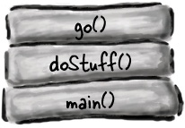

### The Heap

Where ALL objects live

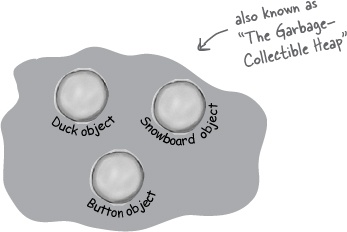  
<br>

> **Instance variables represent the “fields” that each individual object has**.  Instance variables live inside
> the object they belong to.
>
> **Local variables are declared inside a method, including method parameters.** They’re temporary, and live only as
> long as the method is on the stack

## Methods are stacked

When you call a method, the method lands on the top of a call stack. That new thing that’s actually pushed
onto the stack is the stack frame, and it holds the state of the method including which line of code is
executing, and the values of all local variables.

**The method at the top of the stack is always the currently-running method for that stack**

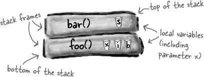

## What about local variables that are objects?

**If the local variable is a reference to an object, only the variable (the reference/remote control) goes on the
stack.**

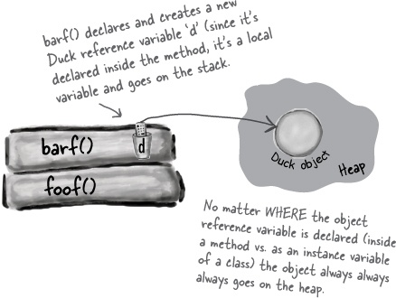  
<br>

> BULLET POINTS
> - All local variables live on the stack, in the frame corresponding to the method where the variables are declared.

## If local variables live on the stack, where do instance variables live?

When you instantiate a new object, Java has to make space on the Heap for that object. But how much space? Enough for
the object, which means enough to house all of the object’s instance variables.
That’s right, instance variables live on the Heap, inside the object they belong to.

When the new object has instance variables that are object references rather than primitives, the real question is:
does the object need space for all of the objects it holds references to? The answer is, not exactly.
Remember that a reference variable value is not the whole object, but merely a remote control to the object.

## The miracle of object creation

Remember the three steps of object declaration and assignment: declare a reference variable, create an object,
and assign the object to the reference.

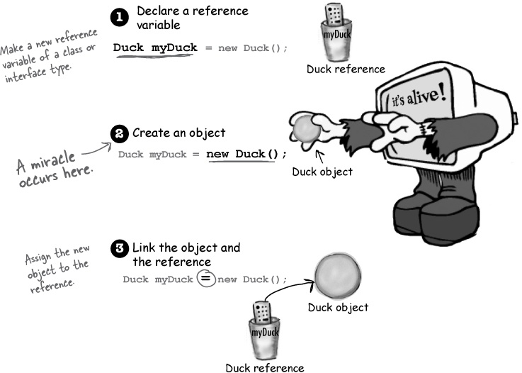

The only way to invoke a constructor is with the keyword **new** followed by the class name. 
The JVM finds that class and invokes the constructor in that class. (OK, technically this isn’t the only way to invoke
a constructor. But it’s the only way to do it from outside a constructor. You can call a constructor from within another
constructor, with restrictions). 

> A constructor has the code that runs when you instantiate an object. In other words, the code that runs when you say
> new on a class type.  
> 
> Every class you create has a constructor, even if you don’t write it yourself.

**The key feature of a constructor is that it runs before the object can be assigned to a reference.
That means you get a chance to step in and do things to get the object ready for use.**

## Initializing the state

Most people use constructors to initialize the state of an object.

> THERE ARE NO DUMB QUESTIONS  
> 
> Q: Are constructors inherited?  
> A: Constructors are not inherited.

## Using the constructor to initialize

The best place to put initialization code is in the constructor.

## Doesn’t the compiler always make a no-arg constructor for you? No!

The compiler gets involved with constructor-making only if you don’t say anything at all about constructors.

**If you write a constructor that takes arguments, and you still want a no-arg constructor,
you’ll have to build the no-arg constructor yourself!**  

**If you have more than one constructor in a class, the constructors MUST have different argument lists.**
**The argument list includes the order and types of the arguments.**  

**Overloaded constructors means you have more than one constructor in your class.**  

You can have two constructors that have identical types, **as long as the order is different.**
<br>

> BULLET POINTS
> - Instance variables live within the object they belong to, on the Heap.
> - If the instance variable is a reference to an object, both the reference and the object it refers to are on the Heap.
> - Overloaded constructors means you have more than one constructor in your class.
> - Instance variables are assigned a default value, even when you don’t explicitly assign one. The default values are
> 0/0.0/false for primitives, and null for references.

## Nanoreview: four things to remember about constructors

1. A constructor is the code that runs when somebody says **new** on a class type
2. A constructor must have the same name as the class, and no return type
3. If you don’t put a constructor in your class, the compiler puts in a default constructor.
   The default constructor is always a no-arg constructor.
4. You can have more than one constructor in your class, as long as the argument lists are different.
   Having more than one constructor in a class means you have overloaded constructors.
   
## Wait a minute... we never DID talk about superclasses and inheritance and how that all fits in with constructors

When an object is created, the object gets space for all the instance variables, from all the way up the inheritance
tree. Conceptually, though, it’s much better to think of it like the picture below, where the object being created has
layers of itself representing each superclass.

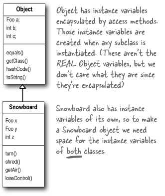

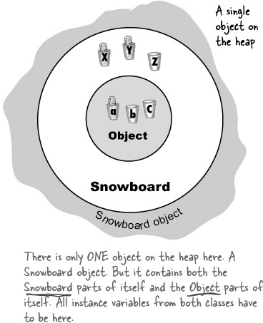

## The role of superclass constructors in an object’s life

**All the constructors in an object’s inheritance tree must run when you make a new object.**

Even abstract classes have constructors.

The super constructors run to build out the superclass parts of the object.

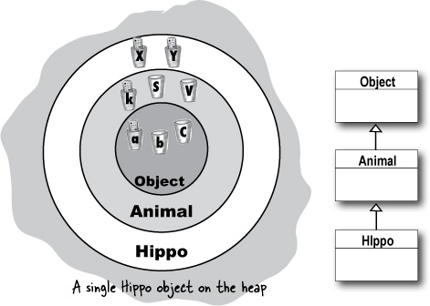

When a constructor runs, it immediately calls its superclass constructor, all the way up the chain
until you get to the class Object constructor.

**This all happens in a process called Constructor Chaining.**

## How do you invoke a superclass constructor?

The only way to call a super constructor is by calling **super()**.

> The compiler gets involved in constructor-making in two ways:
> 
> 1. **If you don’t provide a constructor**  
> The compiler puts one in that looks like:  
>     ```java
>     public ClassName() {
>        super();
>     }
>     ```
> 
> 2. **If you do provide a constructor but you do not put in the call to super()**  
> The compiler will put a call to super() in each of your overloaded constructors (Unless the constructor calls another
> overloaded constructor). The compiler-supplied call looks like: 
>     ```java
>     super();
>     ```

## Can the child exist before the parents?

**The superclass parts of an object have to be fully-formed (completely built) before the subclass parts can be
constructed.**

Each subclass constructor immediately invokes its own superclass constructor, until the Object constructor is on the
top of the Stack.

**The call to super() must be the first statement in each constructor!**

## Superclass constructors with arguments

Can you pass something in to the super() call? Of course. If you couldn’t, you’d never be able to extend a class that
didn’t have a no-arg constructor.

## Invoking one overloaded constructor from another

What if you have overloaded constructors that, with the exception of handling different argument types,
all do the same thing? You know that you don’t want duplicate code sitting in each of the 
constructors (pain to maintain, etc.), so you’d like to put the bulk of the constructor
code (including the call to super()) in only one of the overloaded constructors. You want whichever constructor is first
invoked to call The Real Constructor and let The Real Constructor finish the job of construction.
It’s simple: just say this(). Or this(aString). Or this(27, x). In other words, just imagine that the keyword *this* is
a reference to **the current object**.

You can say this() only within a constructor, and it must be the first statement in the constructor!

But that’s a problem, isn’t it? Earlier we said that super() must be the first statement in the constructor.
Well, that means you get a choice.

**Every constructor can have a call to super() or this(), but never both!**

## Now we know how an object is born, but how long does an object live?

An object’s life depends entirely on the life of references referring to it. If the reference is considered “alive”,
the object is still alive on the Heap. If the reference dies (and we’ll look at what that means in just a moment),
the object will die.

> 1. **A local variable lives only within the method that declared the variable.**
> **A local variable is in scope only within its own method.**  
>   
> 
> 2. **An instance variable lives as long as the object does.**
  

The difference between **life** and **scope** for local variables:

**Life**

A local variable is *alive* as long as its Stack frame is on the Stack. In other words, until the method completes.

**Scope**

A local variable is in *scope* only within the method in which the variable was declared. When its own method calls
another, the variable is alive, but not in scope until its method resumes.
**You can use a variable only when it is in scope.**  
<br>

While a local variable is alive, its state persists. But the local variable can be used only while its Stack frame is
at the top. In other words, you can use a local variable *only* while that local variable’s method is actually running.

## What about reference variables?

The rules are the same for primitives and references. A reference variable can be used only when it’s in scope.
The *real* question is:

**How does variable life affect object life?**

An object is alive as long as there are *live* references to it. And then you have to ask... 
“What happens when the Stack frame holding the reference gets popped off the Stack at the end of the method?” 

If that was the only live reference to the object, the object is now abandoned on the Heap.

The trick is to know the point at which an object becomes **eligible for garbage collection**.

> **An object becomes eligible for GC when its last live reference disappears.**
> 
> **Three ways to get rid of an object’s reference:**
> 
> 1. The reference goes out of scope, permanently.  
> 
>     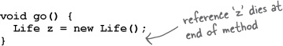
>   
> 
> 2. The reference is assigned another object.  
> 
>     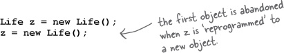
> 
> 
> 3. The reference is explicitly set to null
> 
>     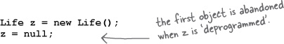


> **The meaning of null**  
> 
> A null reference has bits representing ‘null’ (we don’t know or care what those bits are, as long as the JVM knows).
> 
> **If you use the dot operator on a null reference, you’ll get a NullPointerException at runtime.**
